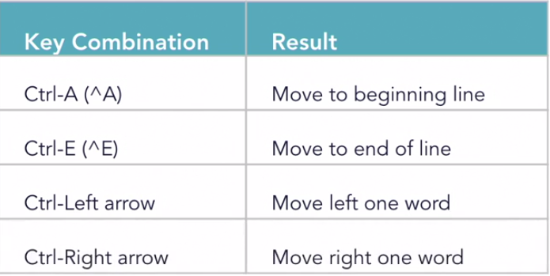
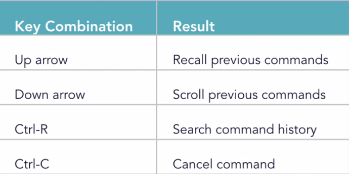

# Command Line Tips

## Tab completion

Automatically completes a file or folder name. 

Makes a guess on the contents of the path so far.

```text
Auto Complete: Press "Tab" Key
Cancel. Press "Ctrl + C"
```

## Text Navigation Shortcuts




## Bash Shortcuts 



