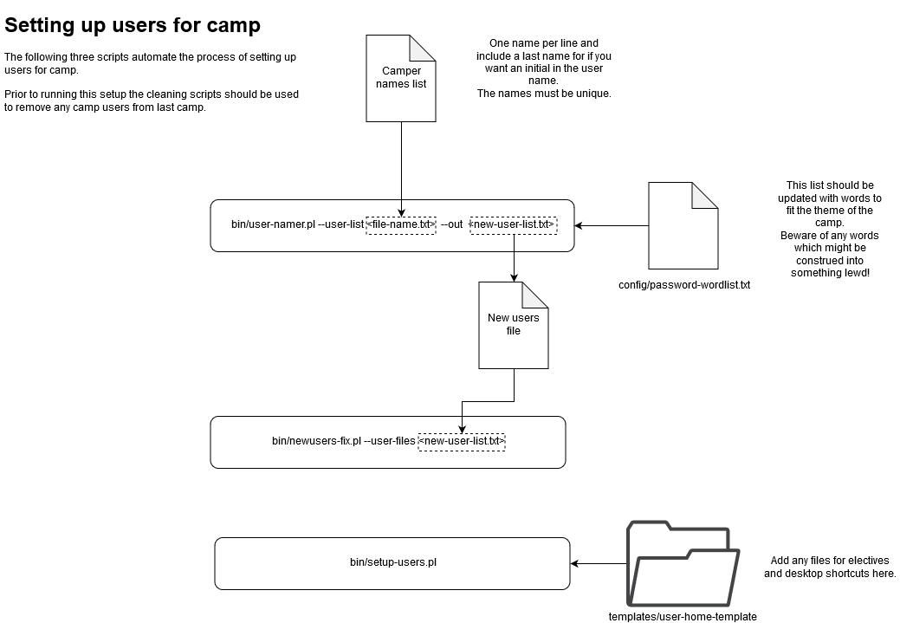

# Introduction


You can find the open source code for the CruTech scripts on the organisations GitHub repository \[[https://github.com/CruTech/crutech-scripts](https://github.com/CruTech/crutech-scripts)\]


Currently included scripts can be found in the `bin` directory of this project. These scripts are:

* `user_namer.pl` for generating adduser compatible lists.
* `newusers-fix.pl` for calling newusers command safely^.
* `setup-users.pl` for filling in users home directories^°.
  * `add-template-to-homes.pl` for adding templated files^.
  * `setup-on-login-hooks.pl` for installing .profile scripts to users^.
* `find-user-files.pl` for collecting and archiving and user files after camp.
* `clean-users.pl` for cleaning up users after a camp^.

**^** These scripts require root user permission, either run from the root user or call with sudo.   
**°** This script requires the presence of a 'starcraft' group to exist on the system, if required execute: groupadd starcraft.

To call these scripts, run them from the project root: `bin/<script-name>.pl [options]`All scripts implement a --help option documentation can be retrieved with: `perldoc <script-name>`.  
You can also see all the script docs in detail in the [Script Explanation Breakdown](scripts-breakdown.md).

