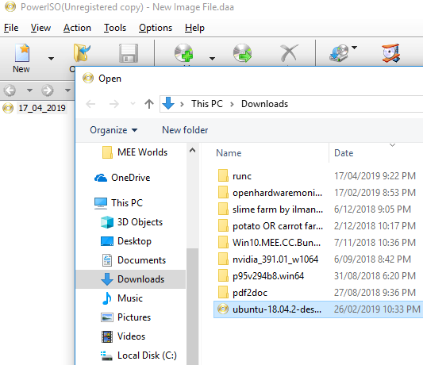

# Installing Ubuntu


If you haven't downloaded and installed PowerISO already, now would be a great time to do it. You can download it [here](http://www.poweriso.com/download.php).



Make sure you have a USB handy \(with a minimum size of 8GB\) handy.  
Make sure it doesn't have anything precious on it, because all of the USBs contents is going to get wiped.


Open PowerISO, navigate to the Ubuntu ISO image and open it.

In the drop down menus at the top choose Tools, from there select "Create bootable USB drive".


When you select the Create bootable USB drive option it will require Administration permission.


Select your USB device and whenever you're ready, hit Start and it will start imaging your USB drive with the ISO image.


ISO imaging may take anywhere from 15 to 30 minutes.  
So you could easily go and get a coffee, go for a walk, and come back, all done.


When the USB ISO imaging is complete, safely remove the USB and place it in your computer.  
Power the computer on and get the computer to the boot screen \(the boot key is usually F9, F2, F12, just try\).


When it loads Ubuntu will greet you with a nice screen. To install the OS you can follow Ubuntu's guide [here](https://tutorials.ubuntu.com/tutorial/tutorial-install-ubuntu-desktop?_ga=2.170969696.1125512427.1555472228-939572801.1551180404#0).


