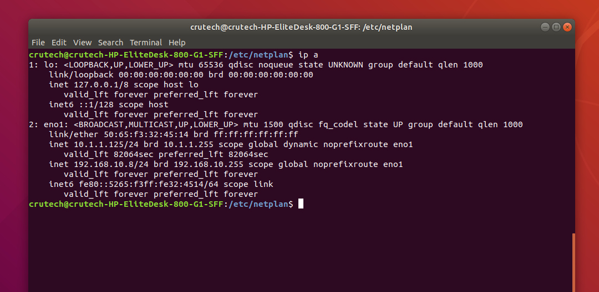
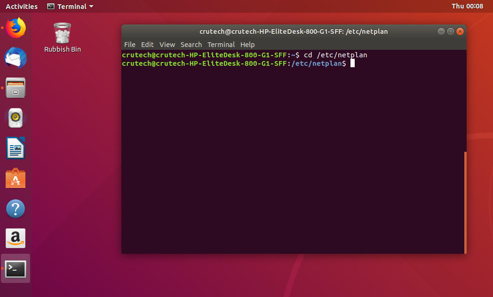
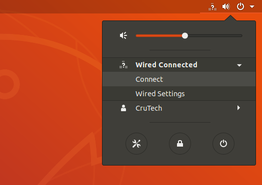
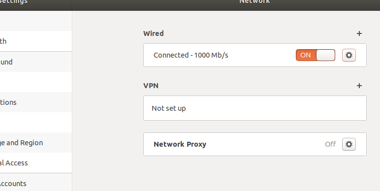
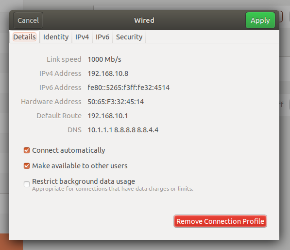

# Setting the Static IP

Once Ubuntu 18.04 is installed. We need to give the computer a static IP address, but first we need to see what the name of the network adaptor is to do this, open a terminal window using CTRL + ALT + T and type:

```text
ip a
```

Look for the "BROADCAST, MULTCAST" section. Before that it should state what the name of your network adaptor is. For example: my network adaptor is eno01



So, now we know what the name of our network adaptor is, we need to navigate to the netplan directory. To do so type into a terminal window:

```text
cd /etc/netplan/
```



Next, we need to open the network manager configuration file, we can do this by using:

```text
sudo nano 01-networkmanager-all.yaml
```

Next we need to copy and add the contents of this file to the YAML file:

```text
    network:
        version: 2
        ethernets:
            en01:
                dhcp4: yes
                addresses: [192.68.0.1/24]
                gateway4: 192.168.0.1
                nameservers:
                    addresses: [192.168.0.1]
```

When we have finished editing the Network Manager file, we can exit by using CTRL + X. Next, we have to tell netstat these new settings that it should have, to do so in your terminal window type:

```text
sudo netplan apply
```

It has now applied our new static address settings..YAY! We can go and check that our settings have actually worked by going to the top right corner and looking for the icon that looks like something to do with networking.



  
Then select Wired, then select Wired Settings. In the Network Settings window select the Cog settings icon. 



Now, as you should see under the Details tab we can see our IPv4 Address, Default Route and our DNS is what we've set it to.




